# Hardware Setup Guide - Bitcoin Lightning Vending Machine

## Overview

This guide covers the complete hardware setup for the Bitcoin Lightning Vending Machine, including connecting both the **Waveshare 3.5" LCD touchscreen** and the **Qibixx MDB Pi HAT** to a single Raspberry Pi running **Ubuntu Server 24.04**.

### Setup Options
- **Headless Setup** (recommended): Complete setup via SSH without monitor/keyboard
- **Traditional Setup**: Using monitor, keyboard, and mouse

This guide focuses on the **headless SSH approach** for professional deployments.

## Hardware Connection Overview

The following diagram shows how the LCD and MDB HAT connect to the Raspberry Pi and share GPIO pins:

```mermaid
graph TB
    subgraph "Physical Hardware Stack"
        LCD["📺 LCD Display<br/>Waveshare 3.5 inch<br/>8 connection wires"]
        HAT["⚙️ MDB Pi HAT<br/>Qibixx board<br/>Uses UART pins"]
        Pi["🥧 Raspberry Pi 5<br/>40-pin GPIO header<br/>Ubuntu 24.04"]
        
        LCD -.->|"8 jumper wires"| HAT
        HAT -->|"40-pin header"| Pi
    end
    
    subgraph "GPIO Pin Usage"
        MDBPins["MDB HAT Uses:<br/>Pin 8: GPIO 14 UART-TX<br/>Pin 10: GPIO 15 UART-RX<br/>Power: 3.3V + 5V + GND"]
        
        LCDPins["LCD Display Uses:<br/>Pin 1: 3.3V → VCC<br/>Pin 6: GND → GND<br/>Pin 19: GPIO 10 → DIN<br/>Pin 23: GPIO 11 → CLK<br/>Pin 24: GPIO 8 → CS<br/>Pin 18: GPIO 24 → DC<br/>Pin 22: GPIO 25 → RST<br/>Pin 12: GPIO 18 → BL"]
    end
    
    subgraph "Connection Solutions"
        Solution1["Solution A:<br/>HAT has passthrough pins<br/>Connect LCD on top"]
        
        Solution2["Solution B:<br/>Use jumper wires<br/>Connect to HAT sides"]
        
        Solution3["Solution C:<br/>Breakout board<br/>Split GPIO access"]
    end
    
    %% Pin conflict resolution
    NoConflict["✅ NO PIN CONFLICTS!<br/>MDB uses UART pins 8,10<br/>LCD uses SPI pins 8,10,11,18,19,22,23,24<br/>Different GPIO functions"]
```



### Key Points About GPIO Pin Sharing:

**✅ No Pin Conflicts**: The MDB HAT and LCD use completely different GPIO functions:
- **MDB HAT**: Uses UART protocol on GPIO 14/15 (pins 8/10)
- **LCD Display**: Uses SPI protocol on GPIO 8/10/11 plus control pins 18/24/25

**🔌 Physical Connection**: The MDB HAT sits directly on the Pi's 40-pin header, then the LCD connects through the HAT using one of three methods:

1. **Passthrough Pins** (if HAT provides them)
2. **Jumper Wires** to accessible pins on HAT edges  
3. **GPIO Breakout Board** for clean connections

## Required Components

### Core Hardware
- **Raspberry Pi 5 8GB** (recommended) or Pi 4 4GB minimum
- **Waveshare 3.5" Touch Screen IPS TFT LCD** (320x480 resolution)
- **Qibixx MDB Pi HAT** (for vending machine communication)
- **27W USB-C PD Power Supply** for Raspberry Pi 5
- **32GB+ MicroSD Card** (Class 10 or better)

### Additional Components
- **Ethernet cable** or WiFi for internet connectivity
- **MDB cable** to connect to vending machine
- **Jumper wires** (if needed for connections)
- **Micro HDMI to HDMI cable** (for initial setup)

## Pin Layout Reference


### Raspberry Pi 5 GPIO Pinout (40-pin header)
```
     3V3  (1) (2)  5V
   GPIO2  (3) (4)  5V
   GPIO3  (5) (6)  GND
   GPIO4  (7) (8)  GPIO14 (UART TX)
     GND  (9) (10) GPIO15 (UART RX)
  GPIO17 (11) (12) GPIO18
  GPIO27 (13) (14) GND
  GPIO22 (15) (16) GPIO23
     3V3 (17) (18) GPIO24
  GPIO10 (19) (20) GND
   GPIO9 (21) (22) GPIO25
  GPIO11 (23) (24) GPIO8
     GND (25) (26) GPIO7
   GPIO0 (27) (28) GPIO1
   GPIO5 (29) (30) GND
   GPIO6 (31) (32) GPIO12
  GPIO13 (33) (34) GND
  GPIO19 (35) (36) GPIO16
  GPIO26 (37) (38) GPIO20
     GND (39) (40) GPIO21
```

## Step 1: Prepare the Raspberry Pi

### 1.1 Install Operating System
1. Flash **Ubuntu Server 24.04 LTS (64-bit)** for Raspberry Pi to your microSD card using Raspberry Pi Imager
2. During imaging with Raspberry Pi Imager:
   - Enable SSH with username/password authentication
   - Set username: `ubuntu` (or your preferred username)
   - Set a strong password
   - **Do NOT configure WiFi yet** (we'll do this via SSH)
3. Insert SD card and boot the Pi
4. Update system:
   ```bash
   sudo apt update && sudo apt upgrade -y
   ```

### 1.2 Headless SSH Setup

This section covers setting up the Raspberry Pi without monitor/keyboard using SSH.

#### Initial Connection Setup
1. **Connect your laptop to WiFi network** (let's call it "WiFi-X")
2. **Connect Raspberry Pi to ethernet** (router/switch with internet access)
3. **Boot the Raspberry Pi** and wait 2-3 minutes for full startup
4. **Find the Pi's IP address**:
   ```bash
   # On your laptop, scan for the Pi
   nmap -sn 192.168.1.0/24
   # Or check your router's admin panel for connected devices
   # Look for "ubuntu" or the hostname you set
   ```

#### SSH Connection
5. **Connect via SSH** from your laptop:
   ```bash
   ssh ubuntu@192.168.1.XXX  # Replace XXX with Pi's IP
   # Enter the password you set during imaging
   ```

#### Configure WiFi via SSH
6. **Configure WiFi using nmtui** (Network Manager Text UI):
   ```bash
   sudo nmtui
   ```
   - Select "Activate a connection"
   - Choose your WiFi network "WiFi-X"
   - Enter WiFi password
   - Select "Activate"
   - Exit nmtui

7. **Verify WiFi connection**:
   ```bash
   ip addr show  # Check for WiFi interface with IP
   ping 8.8.8.8  # Test internet connectivity
   ```

8. **Note the WiFi IP address** for future SSH connections:
   ```bash
   ip addr show wlan0  # Note the inet address
   ```

#### Switch to WiFi-Only Operation
9. **Safely disconnect ethernet**:
   ```bash
   sudo systemctl restart NetworkManager
   # Wait 30 seconds, then physically unplug ethernet cable
   ```

10. **Reboot the Raspberry Pi**:
    ```bash
    sudo reboot
    ```

11. **Reconnect via SSH using WiFi IP**:
    ```bash
    # Wait 2-3 minutes for reboot, then connect using WiFi IP
    ssh ubuntu@192.168.1.YYY  # Replace YYY with WiFi IP noted earlier
    ```

#### Make WiFi Connection Persistent
12. **Ensure WiFi connects automatically** (Ubuntu 24.04 should handle this, but verify):
    ```bash
    # Check network configuration
    sudo nmcli connection show
    
    # If needed, set WiFi to auto-connect
    sudo nmcli connection modify "WiFi-X" connection.autoconnect yes
    ```

### 1.3 Enable Required Interfaces (Ubuntu 24.04)

Ubuntu Server doesn't include `raspi-config`, so we'll configure interfaces manually:

#### Enable SPI Interface
```bash
# Check if SPI is already enabled
ls /dev/spi*

# If not enabled, add to boot config
echo "dtparam=spi=on" | sudo tee -a /boot/firmware/config.txt

# Install SPI tools
sudo apt install python3-spidev -y
```

#### Enable UART for MDB Communication
```bash
# Enable UART and disable Bluetooth (which conflicts with UART)
echo "enable_uart=1" | sudo tee -a /boot/firmware/config.txt
echo "dtoverlay=disable-bt" | sudo tee -a /boot/firmware/config.txt

# Disable serial console (important!)
sudo sed -i 's/console=serial0,115200 //' /boot/firmware/cmdline.txt
```

#### Enable I2C (Optional)
```bash
# Enable I2C for future expansion
echo "dtparam=i2c_arm=on" | sudo tee -a /boot/firmware/config.txt

# Install I2C tools
sudo apt install i2c-tools -y
```

#### Install Required System Packages
```bash
# Install GPIO and hardware interface tools
sudo apt install -y \
    python3-pip \
    python3-venv \
    python3-dev \
    python3-rpi.gpio \
    git \
    build-essential \
    cmake

# Add user to required groups
sudo usermod -a -G dialout,spi,i2c,gpio $USER
```

**Important**: Reboot after making these changes:
```bash
sudo reboot
```

## Step 2: Install the Qibixx MDB Pi HAT

### 2.1 Physical Installation
⚠️ **Power off the Raspberry Pi before installation**

1. **Align the HAT**: The Qibixx MDB Pi HAT sits directly on top of the Raspberry Pi GPIO header
2. **Connect the 40-pin header**: Press the HAT down firmly onto all 40 GPIO pins
3. **Secure with standoffs**: Use the provided standoffs to secure the HAT to the Pi

### 2.2 MDB HAT Pin Usage
The Qibixx MDB Pi HAT uses the following pins:
- **GPIO 14 (Pin 8)**: UART TX - MDB communication
- **GPIO 15 (Pin 10)**: UART RX - MDB communication  
- **3.3V & 5V**: Power for the HAT
- **GND**: Ground connections

### 2.3 MDB Cable Connection
1. Connect the **MDB cable** from your vending machine to the **MDB connector** on the HAT
2. Ensure proper polarity (refer to vending machine documentation)
3. The MDB cable typically carries:
   - **24V power** from vending machine
   - **Data lines** for communication
   - **Ground**

## Step 3: Connect the Waveshare 3.5" LCD

### 3.1 Connection Options
The LCD can be connected in two ways:

#### Option A: Direct GPIO Connection (Recommended)
The LCD connects via SPI using these pins:

| LCD Pin | Pi GPIO Pin | Pi Physical Pin | Function |
|---------|-------------|-----------------|----------|
| VCC     | 3.3V        | Pin 1 or 17     | Power |
| GND     | GND         | Pin 6, 9, 14, 20, 25, 30, 34, 39 | Ground |
| DIN     | GPIO 10     | Pin 19          | SPI MOSI |
| CLK     | GPIO 11     | Pin 23          | SPI SCLK |
| CS      | GPIO 8      | Pin 24          | SPI CE0 |
| DC      | GPIO 24     | Pin 18          | Data/Command |
| RST     | GPIO 25     | Pin 22          | Reset |
| BL      | GPIO 18     | Pin 12          | Backlight |

#### Option B: Via HAT Passthrough
If your MDB HAT has GPIO passthrough pins:
1. Connect the LCD to the corresponding pins on top of the HAT
2. Follow the same pin mapping as above

### 3.2 Wiring the LCD

**Important**: Since the MDB HAT occupies the GPIO header, you have several options:

1. **Use a GPIO Breakout**: Connect a GPIO breakout board to the HAT's passthrough pins
2. **Solder Headers**: If the HAT has GPIO passthrough, solder female headers on top
3. **Use Jumper Wires**: Connect directly to the HAT's available pins

### 3.3 Recommended Wiring Setup
```
Raspberry Pi → MDB HAT → LCD Display

Power Connections:
Pi 3.3V → HAT → LCD VCC
Pi GND → HAT → LCD GND

SPI Connections (if available on HAT):
Pi GPIO 10 (MOSI) → HAT passthrough → LCD DIN
Pi GPIO 11 (SCLK) → HAT passthrough → LCD CLK  
Pi GPIO 8 (CE0) → HAT passthrough → LCD CS

Control Connections (use available GPIO):
Pi GPIO 24 → HAT passthrough → LCD DC
Pi GPIO 25 → HAT passthrough → LCD RST
Pi GPIO 18 → HAT passthrough → LCD BL
```

## Step 4: Physical Assembly

### 4.1 Assembly Order
1. **Pi base** (bottom)
2. **MDB HAT** (middle)
3. **LCD mounting** (top or separate)

### 4.2 Mounting Options

#### Option A: Stacked Configuration
```
[LCD Display] ← connected via jumpers
[MDB Pi HAT]
[Raspberry Pi]
```

#### Option B: Separate LCD Mounting
```
[MDB Pi HAT]     [LCD Display]
[Raspberry Pi] ← connected via → [Mounted separately]
                 ribbon cable
```

### 4.3 Enclosure Considerations
- Ensure the **MDB connector** is accessible for vending machine connection
- Mount the **LCD** for user interaction
- Provide ventilation for the Raspberry Pi
- Consider waterproofing for commercial environments

## Step 5: Configuration

### 5.1 Configure Boot Settings (Ubuntu 24.04)

Edit `/boot/firmware/config.txt` (note: different path than Raspberry Pi OS):
```bash
sudo nano /boot/firmware/config.txt
```

Verify/add these lines (some may already be added from Step 1.3):
```ini
# Enable SPI for LCD
dtparam=spi=on

# Enable UART for MDB communication
enable_uart=1
dtparam=uart=on

# Disable Bluetooth to free up UART
dtoverlay=disable-bt

# LCD Display Configuration
dtoverlay=spi0-1cs,cs0_pin=8
dtparam=cs0_spidev=on

# Optional: Increase GPU memory for better display performance
gpu_mem=128

# Optional: Disable onboard WiFi LED (reduces interference)
dtparam=act_led_trigger=none
```

Also verify `/boot/firmware/cmdline.txt` doesn't contain serial console:
```bash
# Check current cmdline
cat /boot/firmware/cmdline.txt

# Should NOT contain: console=serial0,115200
# If it does, remove it:
sudo sed -i 's/console=serial0,115200 //' /boot/firmware/cmdline.txt
```

### 5.2 Test Hardware Connections

#### Test MDB HAT
```bash
# Check if MDB device is detected
ls -la /dev/ttyAMA*
# Should show /dev/ttyAMA0

# Test serial communication
sudo minicom -D /dev/ttyAMA0 -b 9600
```

#### Test LCD Display
```bash
# Check SPI interface
ls -la /dev/spi*
# Should show /dev/spidev0.0

# Test SPI communication
sudo python3 -c "
import spidev
spi = spidev.SpiDev()
spi.open(0, 0)
print('SPI interface working!')
spi.close()
"
```

## Step 6: Install and Test Software

### 6.1 Clone and Install Project
```bash
git clone <your-repository-url>
cd pow-vending-machine
cd scripts
chmod +x install.sh
./install.sh
```

### 6.2 Configure Environment
```bash
cp config/env_template.txt .env
nano .env
```

Fill in your BTCPay Server details and adjust hardware settings:
```bash
# Hardware Configuration
MDB_SERIAL_PORT=/dev/ttyAMA0
MDB_BAUD_RATE=9600

# Display Configuration  
DISPLAY_WIDTH=320
DISPLAY_HEIGHT=480
DISPLAY_ROTATION=90
```

### 6.3 Test Individual Components
```bash
source venv/bin/activate

# Test all components
python tests/test_components.py

# Test on macOS (simulator)
python tests/test_mac.py

# Run full simulator
python tests/simulator.py
```

### 6.4 Run the Application
```bash
# Run manually
python main.py

# Or start as service
sudo systemctl enable bitcoin-vending.service
sudo systemctl start bitcoin-vending.service
```

## Troubleshooting

### Common Issues

#### MDB Communication Problems
- **Check serial port**: Ensure `/dev/ttyAMA0` exists
- **Verify connections**: Check MDB cable and HAT installation
- **Test with multimeter**: Verify 24V power from vending machine
- **Check permissions**: User must be in `dialout` group

#### LCD Display Issues
- **SPI not working**: Verify SPI is enabled in `raspi-config`
- **No display**: Check power connections (3.3V, GND)
- **Garbled display**: Verify wiring and SPI configuration
- **Touchscreen not working**: May need additional driver installation

#### SSH Connection Issues
- **Cannot find Pi IP**: Check router admin panel for "ubuntu" device
- **SSH connection refused**: Wait longer for Pi boot (3-5 minutes)
- **Permission denied**: Verify username/password set during imaging
- **SSH key issues**: Use password authentication initially: `ssh -o PreferredAuthentications=password ubuntu@IP`

#### WiFi Issues  
- **nmtui not found**: Install with `sudo apt install network-manager`
- **WiFi not connecting**: Check signal strength, verify password
- **No internet after WiFi**: Restart NetworkManager: `sudo systemctl restart NetworkManager`
- **Can't find wlan0**: Check with `ip link show`, may be named differently

#### Ubuntu 24.04 Specific Issues
- **Wrong config path**: Use `/boot/firmware/config.txt` NOT `/boot/config.txt`
- **Missing raspi-config**: Not available on Ubuntu, use manual configuration
- **GPIO permissions**: Ensure user in `gpio` group: `groups` command should show it
- **SPI/I2C not working**: Install tools: `sudo apt install python3-spidev i2c-tools`

#### Power Issues
- **System instability**: Use official 27W power supply for Pi 5
- **Random reboots**: Check power supply capacity
- **MDB not responding**: Verify 24V from vending machine

### Debug Commands
```bash
# Check GPIO state
gpio readall

# Monitor serial communication
sudo cat /dev/ttyAMA0

# Check SPI devices
ls -la /dev/spi*

# View system logs
sudo journalctl -u bitcoin-vending.service -f

# Check process status
sudo systemctl status bitcoin-vending.service
```

### LED Status Indicators
Many MDB HATs have status LEDs:
- **Power LED**: Should be solid green
- **Communication LED**: Flashes during MDB activity
- **Error LED**: Indicates communication problems

## Safety Considerations

### Electrical Safety
- **Always power off** before making connections
- **Verify voltages** with multimeter before connecting
- **Use proper fuses** in commercial installations
- **Ground the system** properly

### Commercial Installation
- **Use industrial-grade components** for harsh environments
- **Implement proper ventilation** and cooling
- **Consider surge protection** for power lines
- **Regular maintenance schedule** for connections

## Performance Optimization

### System Tuning
```bash
# Increase GPU memory for better display performance
echo "gpu_mem=128" | sudo tee -a /boot/config.txt

# Optimize for real-time performance
echo "isolcpus=3" | sudo tee -a /boot/cmdline.txt

# Disable unnecessary services
sudo systemctl disable bluetooth
sudo systemctl disable wifi-powersave
```

### Monitoring
Set up monitoring for:
- **Component temperatures**
- **Power consumption**
- **Network connectivity**
- **MDB communication health**
- **Payment processing latency**

## Maintenance

### Regular Checks
- **Clean connections** monthly
- **Check cable integrity** 
- **Verify backup power** systems
- **Update software** regularly
- **Monitor logs** for errors

### Component Lifespan
- **LCD backlight**: 20,000-50,000 hours
- **SD card**: Replace annually in commercial use
- **MDB HAT**: Check for corrosion on connectors
- **Power supply**: Monitor for voltage stability

---

## Quick Reference

### Essential Commands
```bash
# SSH Connection
ssh ubuntu@WIFI_IP_ADDRESS

# Find Pi IP address (from laptop)
nmap -sn 192.168.1.0/24

# Check network interfaces
ip addr show

# Configure WiFi
sudo nmtui

# Start system
sudo systemctl start bitcoin-vending.service

# Stop system  
sudo systemctl stop bitcoin-vending.service

# View logs
tail -f /var/log/vending_machine.log

# Test hardware
python tests/test_components.py

# Check status
sudo systemctl status bitcoin-vending.service
```

### Pin Summary
- **MDB Communication**: GPIO 14/15 (Pins 8/10)
- **LCD SPI**: GPIO 8/10/11 (Pins 24/19/23)
- **LCD Control**: GPIO 18/24/25 (Pins 12/18/22)
- **Power**: 3.3V and 5V pins
- **Ground**: Multiple GND pins available

This setup provides a robust, commercial-grade Bitcoin Lightning vending machine with proper hardware integration and comprehensive monitoring capabilities. 